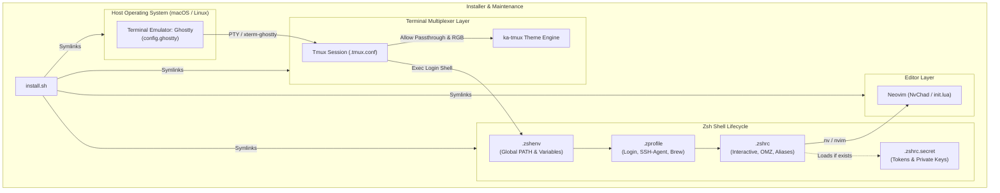

# Technical Architecture

## 1. Component Architecture

Repository ini mengadopsi pola **Hierarchical Shell Lifecycle & Declarative Dotfile Management**. Konfigurasi dibagi berdasarkan siklus eksekusi Zsh, abstraksi multiplexer/terminal, editor layer, serta bootstrap script yang dapat dieksekusi secara idempoten.

## 2. Request & Execution Flow

### 2.1 Terminal Startup & Shell Initialization
1. **Ghostty Execution**: Membaca [config.ghostty](file:///Users/i/dotfile/config.ghostty), menerapkan window geometry, font ligatures (*FiraCode Nerd Font Propo*), tema warna *Ayu*, dan mode fullscreen.
2. **Environment Sourcing (`.zshenv`)**: Dieksekusi untuk setiap pemanggilan subshell. Membersihkan duplications pada `PATH`, mendefinisikan direktori SDK (Node, Go, Java, Flutter, Android, Maven).
3. **Login Shell Phase (`.zprofile`)**:
   - Memeriksa flag `__SSH_AGENT_ALREADY_RUN`.
   - Menjalankan `ssh-agent` jika belum aktif dan menyimpan env ke `~/.ssh/agent-environment`.
   - Memindai semua kunci publik `~/.ssh/*.pub` dan otomatis mendaftarkannya ke agent via `ssh-add` jika belum ada di keyring.
   - Mengaktifkan Homebrew shell environment di macOS (`/opt/homebrew/bin/brew shellenv`).
4. **Interactive Shell Phase (`.zshrc`)**:
   - Menginisialisasi Oh My Zsh dengan tema `agnoster`.
   - Memuat plugin Zsh (`git`, `mvn`, `zsh-autosuggestions`, `zsh-syntax-highlighting`, `you-should-use`, `zsh-bat`).
   - Menerapkan custom aliases (`lsd`, `git`, `flutter`, `php artisan`).
   - Memuat file rahasia lokal `~/.zshrc.secret` jika ada.

### 2.2 Tmux Passthrough & Graphics Protocol Flow
1. Sesi Tmux berjalan dengan `TERM=tmux-256color` dan overrides `xterm-ghostty:RGB`.
2. Opsi `allow-passthrough on` mengizinkan aplikasi TUI (seperti Neovim atau CLI image viewer) mengirim escape code Kitty Graphics Protocol langsung ke Ghostty.
3. Fitur `set-clipboard on` memetakan OSC 52 sehingga penyalinan teks di dalam Tmux langsung tersinkron ke macOS clipboard.

## 3. Concurrency & Resource Management
- **Shell Concurrency**: Model eksekusi Zsh berjalan single-threaded per process surface. Subshell dan external processes dipanggil via fork/exec.
- **SSH Agent Daemon**: Proses `ssh-agent` berjalan persisten di level user session (`SSH_AGENT_PID`), diakses melalui socket Unix domain (`SSH_AUTH_SOCK`).
- **Resource Limits**:
  - Tmux `history-limit` disetel ke `100000` baris.
  - Ghostty `scrollback-limit` disetel ke `10000000` baris dengan background blur dan GPU rendering native.

## 4. Error Handling & Fault Tolerance
- **Strict Execution di Installer**: [install.sh](file:///Users/i/dotfile/install.sh) menggunakan `set -eo pipefail` dan error trap `abort()` untuk mencegah kegagalan silent saat download/symlink dependencies.
- **Defensive Sourcing**:
  - Pengecekan file eksis `[ -f "$file" ]` diterapkan pada seluruh script sebelum pemanggilan `source` atau eksekusi binary (`brew`, `java_home`, `lsd`, dll.).
  - Di [.zprofile](file:///Users/i/dotfile/.zprofile), command `ssh-keygen -lf` dialihkan output error-nya ke `/dev/null` (`2>/dev/null`) agar tidak mencemari terminal jika terdapat symlink kunci yang broken.

## 5. Observability & Telemetry
- **CI Static Analysis**: [.github/workflows/reviewdog.yaml](file:///Users/i/dotfile/.github/workflows/reviewdog.yaml) menggunakan GitHub Actions untuk menjalankan `shellcheck` secara otomatis pada setiap pull request melalui `reviewdog`.
- **Runtime Monitoring**: Shell logging standar via return code (`$?`) dan status line Tmux yang menampilkan host, active window, dan session info.

## 6. Data & Domain Boundaries
- **Public vs Secret Boundary**:
  - Semua file konfigurasi umum di-commit publik.
  - Secret lokal, private keys, dan corporate access tokens diisolasi secara ketat di `~/.zshrc.secret` (di-ignore oleh git via `.gitignore`).
  - Kunci SSH pribadi disimpan di `~/.ssh/` (di luar repositori dotfile) dan diload secara dinamis.
